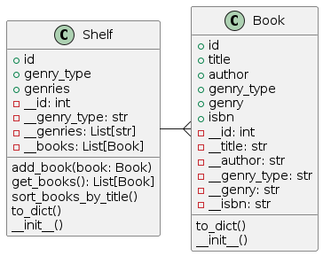

# Milestone 8: Bookshelf

Alice is a bookworm, she adores reading and organizing books. One day she comes to Bob’s home and sees the total mess in his books - they are all over his room without any order or structure. She can't leave it this way!

Let's help Alice using our new knowledge. We will build a digital catalog for Bob and make it easier for Alice to order the books.

First of all, create a UML diagram of the domain. You're free to choose classes and names to model, but be sure to include classes Book and Shelf. Bob's room is a collection of shelves.

Code up your classes from the diagram. Then, start organizing (write a separate function for each step):

1. Starting with a huge pile (set) of books, organize them into the shelves by category.

There can be more categories than books, so one shelf can contain multiple categories. But books of the same category must always be on the same shelf.

2. Iterate over all the shelves and sort the books by title in ascending order.

Create a couple of books (e.g. with Faker library or manually) to show that your program works.

## Prepare env

```bash
python3 -m venv .venv
. .venv/bin/activate
pip3 install -r requirements.txt
```

## UML



[PlantUML.txt](uml/PlantUML.txt)


## Generate Books Data

```bash
python3 generate_data.py
```
Generated data will be saved to [unsorted_books.csv](unsorted_books.csv)


## Run Books organiser


Books organiser will place books to shelfes by genres and genres type, save result to [Bob_books_room.json](Bob_books_room.json)

```bash
python3 books_organiser.py
```